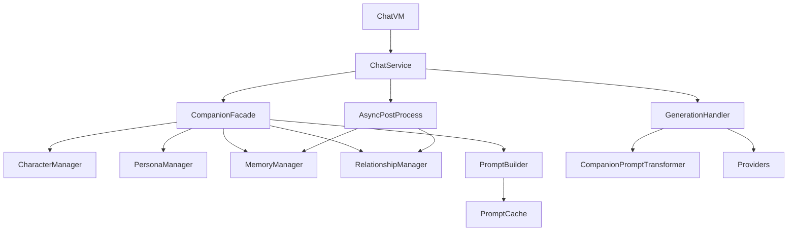

# Solace Companion Architecture Design

## Goals
Solace needs stronger AI companion behavior similar to SillyTavern, but it runs inside a native Android app where smoothness is the top priority.

This design keeps the companion capability lightweight, cacheable, and isolated from the existing provider and streaming stack.

Core goals:

- Keep chat rendering smooth at 60FPS.
- Avoid UI-thread AI work.
- Avoid rebuilding large prompts on every message chunk.
- Reuse existing RikkaHub conversation, assistant, and transformer infrastructure.
- Add companion features in small phases with safe fallbacks.

## Design Principles

1. The companion system must not block the chat send or streaming path.
2. All heavy work must happen off the main thread on `Dispatchers.IO`.
3. Companion state must be conversation-scoped or assistant-scoped, not duplicated into every message.
4. Prompt assembly must be incremental and cache-friendly.
5. Existing `ChatService`, provider adapters, model request objects, and stream handling should remain largely unchanged.

## Architecture Overview

## Module Design

### CompanionFacade
Single orchestration entry for the chat pipeline.

Responsibilities:

- Resolve the effective companion context before generation.
- Return a cached prompt bundle for this generation round.
- Trigger asynchronous memory and relationship updates after generation completes.
- Invalidate prompt cache when companion state changes.

### CharacterManager
Owns character card resolution and in-memory caching.

Responsibilities:

- Read the structured character card attached to an assistant.
- Cache parsed character data in memory keyed by assistant ID.
- Avoid repeated deserialization or prompt extraction on every send.

### PersonaManager
Builds a lightweight user persona block.

Responsibilities:

- Resolve persona from user nickname and future persona settings.
- Convert persona data into a compact prompt block.
- Avoid large or dynamic persona graphs.

### MemoryManager
Maintains lightweight three-level memory.

Responsibilities:

- Use the existing conversation as short memory.
- Maintain a compact medium-memory summary per conversation.
- Extract and store stable long-memory facts incrementally.
- Run only after generation in the background.

### RelationshipManager
Tracks a small companion state model instead of a complex simulation.

Responsibilities:

- Update `relationshipLevel`, `interactionCount`, `lastInteractionTime`, and `emotionState`.
- Derive a small response-style hint from relationship state.
- Keep updates asynchronous and cheap.

### PromptBuilder
Builds ordered prompt blocks and outputs a reusable prompt bundle.

Responsibilities:

- Merge system-adjacent companion blocks in a stable order.
- Keep the block model explicit and cacheable.
- Produce small, structured prompt text instead of giant templates.

### PromptCache
Caches the final companion prompt bundle.

Responsibilities:

- Reuse prompt bundles while character, persona, memory, relationship, and recent-message signatures are unchanged.
- Prevent prompt rebuild during streaming updates.
- Keep the cache entirely off the UI path.

## Data Structures

### Character

`CharacterEntity`

- `id`
- `name`
- `avatar`
- `description`
- `personality`
- `speakingStyle`
- `scenario`
- `systemPrompt`
- `firstMessage`
- `postHistoryInstructions`
- `exampleDialogue`
- `updatedAt`

Storage choice:

- Persist as part of the assistant configuration for imported character cards.
- Cache once in memory per assistant through `CharacterManager`.

### Persona

`PersonaEntity`

- `id`
- `displayName`
- `description`
- `title`
- `injectionPosition`
- `injectDepth`
- `enabled`

Storage choice:

- Start with a lightweight derived persona from user nickname.
- Leave room for future persisted persona editing without changing the runtime model.

### Memory

`CompanionState`

- `mediumMemorySummary`
- `mediumMemoryUpdatedAt`
- `lastAnalyzedUserMessageCount`
- `longMemoryFacts`
- `relationshipState`
- `responseStyle`
- `memoryVersion`
- `relationshipVersion`

Storage choice:

- Persist conversation-scoped companion state in a separate local file store.
- Do not append medium/long memory text to each message.

Memory levels:

1. `ShortMemory`
   - Reuse `Conversation.currentMessages`.
2. `MediumMemory`
   - Compact summary of recent important interaction.
3. `LongMemory`
   - Stable user facts such as preferences, habits, or birthdays.

### Relationship

`RelationshipState`

- `relationshipLevel`
- `interactionCount`
- `lastInteractionTime`
- `emotionState`
- `affectionScore`
- `trustScore`

This is intentionally small and prompt-oriented.

### Prompt Bundle

`PromptBlock`

- `type`
- `position`
- `role`
- `order`
- `cacheKey`
- `content`
- `enabled`

`PromptBundle`

- `cacheKey`
- `blocks`

## Thread Model

### Main Thread
Allowed work:

- Compose rendering
- user input
- state observation
- small state updates

Forbidden work:

- character parsing
- memory extraction
- relationship analysis
- file I/O
- database I/O
- large prompt building

### IO Dispatcher
All non-UI companion work must run on `Dispatchers.IO`.

Includes:

- loading and saving companion state
- memory extraction
- cache invalidation
- character import parsing
- background summary updates

### Generation Lifecycle

1. User sends a message.
2. `ChatService` appends the user message normally.
3. `CompanionFacade` prepares a prompt bundle using cached character, persona, memory, and relationship data.
4. `GenerationHandler` runs the existing request pipeline.
5. The companion prompt bundle is injected by an input transformer.
6. After generation completes, `CompanionFacade` asynchronously updates memory and relationship state.

## Prompt Assembly Strategy

Prompt block order:

1. Base system prompt from assistant
2. Character block
3. Persona block
4. Long memory block
5. Medium memory block
6. Relationship and response-style block
7. Post-history instruction block
8. Recent conversation context

Notes:

- The base system prompt still belongs to the existing assistant model.
- The companion layer only injects companion-specific blocks.
- Blocks are skipped when empty.
- Blocks are cached using a small signature made from character, persona, companion state, and recent chat window.

## Performance Strategy

### UI Safety

- No companion processing in Compose.
- No companion recalculation per streamed token chunk.
- No synchronous conversation-wide rescans during typing or animation.

### Prompt Efficiency

- Rebuild prompt only when dependencies change.
- Keep prompt blocks compact and ordered.
- Avoid full prompt reconstruction during stream updates.

### Memory Efficiency

- Persist conversation companion state outside the large message-node table.
- Keep only a compact summary and a small fact list.
- Limit list sizes for long-memory facts.

### Rendering Safety

- Do not expose large mutable companion objects to chat item composables.
- Prefer `StateFlow`, `remember`, and `derivedStateOf` for any future UI wiring.

## Integration With Existing RikkaHub Code

### Existing Integration Points

- `ChatService` orchestrates send and post-generation work.
- `GenerationHandler` already runs on `Dispatchers.IO`.
- `TransformerContext` is the best place to carry a prepared companion prompt bundle.
- `PromptInjectionTransformer` already proves the prompt-block insertion model works in this codebase.

### Planned Runtime Integration

- Add `CompanionFacade` to `ChatService`.
- Prepare a bundle before calling `GenerationHandler.generateText()`.
- Pass the bundle through `TransformerContext`.
- Inject it with a dedicated `CompanionPromptTransformer`.
- After generation success, launch background companion updates without delaying the user-visible result.

## SillyTavern Compatibility Strategy

Borrow:

- structured character card fields
- separated persona block
- rolling summary memory
- prompt block ordering
- post-history instruction

Defer:

- complex recursive lore scanning
- probabilistic trigger logic
- full prompt-manager customization UI
- heavy relationship simulation

## Implementation Phases

### Phase 1

- Create this architecture document.
- Introduce companion data models and local state store.
- Add the companion facade and managers as independent modules.

### Phase 2

- Add prompt bundle creation and in-memory cache.
- Inject bundle through the transformer pipeline without touching providers.

### Phase 3

- Import structured character data from SillyTavern cards into assistant companion data.
- Keep a fallback path for older assistants that only have a flat system prompt.

### Phase 4

- Add asynchronous memory and relationship updates after generation.
- Keep updates failure-tolerant and invisible to the main chat path.

## Guardrails

- If companion is disabled for an assistant, the runtime overhead should be close to zero.
- Companion update failures must never break chat generation.
- Streaming must remain unchanged.
- The companion layer must be removable or extensible without rewriting provider code.
