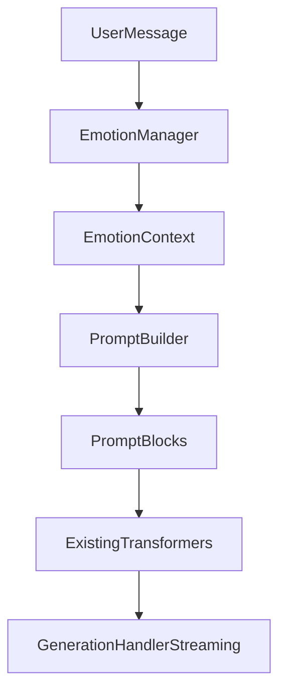

# Emotion Layer Design

## 1. Goals

在现有 Solace Companion 架构中新增轻量情绪层（Emotion Layer），用于让回复策略更贴近用户当前情绪，同时严格满足移动端性能约束。

约束与边界：

- 不增加额外 LLM 调用。
- 不阻塞聊天主流程，不影响 streaming。
- 不修改 `ChatService`、`Provider`、`Streaming` 相关实现。
- 仅在 `PromptBuilder` 侧读取 `EmotionContext`，作为 prompt 上下文块拼接。

## 2. Module Scope

新增目录：

- `app/src/main/java/me/rerere/rikkahub/data/companion/emotion/`

新增文件：

- `EmotionType.kt`
- `EmotionContext.kt`
- `EmotionManager.kt`

设计原则：

- 模块独立，纯 Kotlin 规则分析，无网络依赖。
- 规则优先，固定小词表，避免复杂 NLP 管线。
- 输出结构稳定、可缓存、可快速序列化。

## 3. Data Structures

### 3.1 EmotionType

用途：定义基础情绪分类，保持低复杂度，避免过度心理推断。

建议枚举：

- `NEUTRAL`
- `HAPPY`
- `EXCITED`
- `TIRED`
- `SAD`
- `ANXIOUS`
- `ANGRY`
- `LONELY`

说明：

- `HAPPY`、`EXCITED` 归为 positive。
- `TIRED`、`SAD`、`ANXIOUS`、`ANGRY`、`LONELY` 归为 negative。
- 无明显信号统一归 `NEUTRAL`。

### 3.2 EmotionContext

用途：PromptBuilder 消费的标准上下文对象。

建议字段：

- `emotion: EmotionType`
- `intensity: Float`（0.0 ~ 1.0）
- `responseStyle: String`（如 `comfort` / `calm_ack` / `light_positive` / `neutral`）
- `keywords: List<String>`（触发关键词，最多保留 3~5 个）
- `confidence: Float`（可选，0.0 ~ 1.0）
- `sourceHash: Int`（可选，用于缓存命中校验）

输出示例：

```json
{
  "emotion": "SAD",
  "intensity": 0.72,
  "responseStyle": "comfort",
  "keywords": ["难过", "失落"],
  "confidence": 0.78
}
```

## 4. EmotionManager Design

### 4.1 Responsibilities

- 输入：当前用户最新消息文本（必要）与少量最近上下文（可选）。
- 分析：情绪类型、强度、回复倾向。
- 输出：`EmotionContext`。
- 缓存：对相同输入文本快速复用结果。

### 4.2 Lightweight Rule Engine

第一阶段采用“关键词 + 权重 + 简单修饰词”规则。

关键词表示例（简化）：

- `SAD`: 难过、伤心、失落、想哭、心情不好
- `TIRED`: 累、好困、疲惫、没力气、精力不足
- `ANXIOUS`: 焦虑、紧张、害怕、慌、压力大
- `ANGRY`: 生气、烦死了、火大、气死、恼火
- `LONELY`: 孤独、寂寞、一个人、没人懂
- `HAPPY`: 开心、高兴、愉快、不错、满足
- `EXCITED`: 兴奋、激动、太棒了、爽、冲

强度估计（轻量）：

- 基础分：命中关键词权重累加。
- 强化词加成：非常、特别、太、真的、超级。
- 缓和词减弱：有点、还好、一般般。
- 标点加成：`!`、重复感叹。
- 最终归一化到 `[0, 1]`。

冲突处理：

- 同时命中正负时，以分值高者为主。
- 分值接近（阈值内）则降级为 `NEUTRAL`，避免误判。

### 4.3 ResponseStyle Mapping

根据 `EmotionType + intensity` 映射固定策略：

- `SAD` -> `comfort`
- `TIRED` -> `gentle_brief`
- `ANXIOUS` -> `calm_grounding`
- `ANGRY` -> `calm_ack`
- `LONELY` -> `warm_presence`
- `HAPPY` -> `light_positive`
- `EXCITED` -> `high_energy_positive`
- `NEUTRAL` -> `neutral`

## 5. PromptBuilder Integration

## 5.1 Prompt Order

在现有顺序中插入 Emotion Context：

1. System Prompt
2. Character Prompt
3. Relationship Context
4. Memory Context
5. Emotion Context
6. Conversation History
7. User Message

### 5.2 Emotion Prompt Block

`PromptBuilder` 新增一个轻量 block（例如 `type = emotion`）：

- 仅使用 `EmotionContext` 生成短规则文本（3~6 行）。
- 不引入长模板，不做复杂拼接。
- 空值或 `NEUTRAL` 可输出极短 guidance 或直接跳过。

示例（sad）：

- User emotional state: sad (intensity 0.72)
- Reply strategy: comfort
- Constraints:
  - acknowledge feelings first
  - avoid jumping into solutions immediately
  - keep tone warm and companion-like
  - ask at most one gentle follow-up question

## 6. Runtime Flow



流程说明：

- EmotionManager 在 companion 层内执行，不新增模型请求。
- 输出仅参与 prompt block 构建。
- 不进入 streaming chunk 处理循环。

## 7. Performance Design

### 7.1 CPU & Allocation Control

- 固定关键词词典为静态常量，避免每次创建对象。
- 规则计算只扫描“最新用户消息文本”，默认不全量扫描历史。
- 限制关键词回传数量（最多 3~5）。
- 避免复杂正则链；优先 `contains` + 少量预编译 pattern。

### 7.2 Cache Strategy

缓存键建议：

- `hash(latestUserMessageNormalized)`

缓存值：

- `EmotionContext`

策略：

- 命中直接复用。
- LRU 小缓存（如 64 或 128 条）即可。
- 在内存中维护，不落盘。

### 7.3 Threading

- Emotion 分析属于轻量 CPU 任务，可在 companion 现有后台流程执行。
- 不在 UI 线程做分析。
- 不阻塞发送主路径；若结果未就绪，使用上次 context 或 `NEUTRAL` 回退。

## 8. Risk & Mitigation

风险：

- 误判情绪导致语气不准确。
- 高频短消息导致多次重复计算。

缓解：

- 分类保持少而稳，冲突时退回 `NEUTRAL`。
- 增加缓存与最小触发策略（文本无变化不重算）。
- 提示词采用“约束建议”而非“绝对诊断”，避免过度推断用户心理。

## 9. Phase-1 Implementation Plan

仅实现最小可用版本（MVP）：

1. 新增 `EmotionType` / `EmotionContext` 数据结构。
2. 新增 `EmotionManager`（规则引擎 + LRU 缓存）。
3. 在 `PromptBuilder` 增加 Emotion block 构建能力。

保持不变：

- `ChatService`
- `Provider`
- `Streaming`
- 现有 generation 调用流程

## 10. Acceptance Criteria

- 编译通过，无新增 lint 错误。
- Chat 回复速度无明显下降。
- streaming 行为与现状一致。
- 在 sad / tired / happy / angry 等典型输入下，prompt 中包含对应策略约束。
