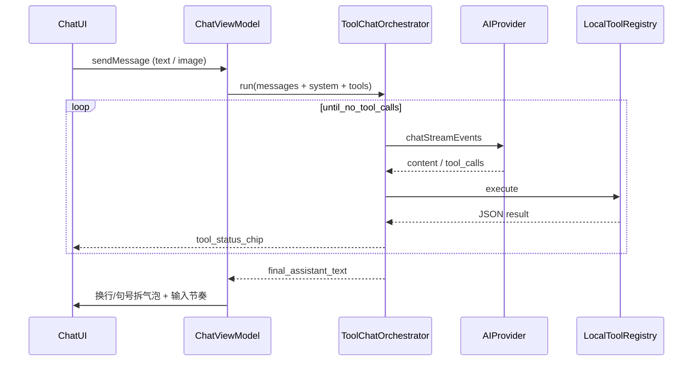

# Solace

Android 原生 **AI 伴侣客户端**：Home 中枢、人设 Agent、场景化主动关怀、长期记忆、口语化短气泡节奏，以及可选的手机感知工具。

支持 **OpenAI 兼容**、**Anthropic（Claude）原生**、**Google Gemini 原生** 三类协议；内置多 Provider 预设（自定义 Base URL / Key / 模型）。

> **原创声明**：本仓库代码与 UI 均为独立实现。产品体验上可参考常见伴侣客户端的交互直觉，**不包含、不派生** 橘瓣 / RikkaHub 等第三方 AGPL 源码。推送与署名仅属于仓库所有者本人。

---

## 技术栈

| 层级 | 技术 |
|------|------|
| 语言 | Kotlin 2.0 / JVM 17 |
| UI | Jetpack Compose + Material 3 |
| 架构组件 | Navigation Compose、ViewModel、Lifecycle |
| DI | Hilt |
| 本地存储 | Room、SharedPreferences、EncryptedSharedPreferences（API Key） |
| 网络 | Retrofit + OkHttp + Moshi（SSE 流式；含自定义消息 / Map 适配器） |
| 图片 | Coil（头像 / Markdown 图片） |
| 后台任务 | WorkManager（场景化主动关心） |
| 最低系统 | Android 8.0（API 26），compile/target SDK 36 |
| 版本 | 1.0.0（`applicationId`: `com.agent.chat`） |

---

## 架构概览

采用经典分层，业务以「对话编排 + 工具循环」为中心；UI 以 Home 为入口串联各模块：

```
┌─────────────────────────────────────────────────────────┐
│  ui/                                                    │
│  home / chat / memory / agent / profile                 │
│  conversation / persona / settings / motion / components│
└───────────────────────────┬─────────────────────────────┘
                            │
┌───────────────────────────▼─────────────────────────────┐
│  data/                                                  │
│  ├── ai/           编排、提示词、本地工具注册表           │
│  ├── provider/     OpenAI / Anthropic / Gemini + 网络层  │
│  ├── repository/   会话 / 人设 / 记忆 / Provider          │
│  ├── local/        Room Entity + DAO + Migrations       │
│  ├── memory/       异步增量摘要                          │
│  ├── care/         生活感知 / 情绪 / 待跟进               │
│  ├── proactive/    场景化主动关心 Worker                 │
│  ├── screen|notification/  无障碍读屏 / 通知监听         │
│  └── settings/     伴侣感 / 工具 / 权限相关开关           │
└───────────────────────────┬─────────────────────────────┘
                            │
┌───────────────────────────▼─────────────────────────────┐
│  domain/        Message / Persona / Memory / AppError   │
│  di/            Hilt Module                             │
└─────────────────────────────────────────────────────────┘
```

### 对话与工具循环



核心类：

- `ToolChatOrchestrator` — 多轮 tool 调用（上限 8 步）
- `AIProviderFactory` — 按 `ProviderType` 分发到 OpenAI 兼容 / Anthropic / Gemini
- `OpenAICompatibleProvider` / `AnthropicProvider` / `GoogleGeminiProvider` — 流式；产出 `ContentDelta` / `ToolCallDelta` / `Finished`
- `ChatMessageJsonAdapter` — 统一文本与多模态 `content` / `contentParts` 序列化
- `LocalToolRegistry` — 按设置开关组装工具定义
- `PromptContextInjector` — 人设占位符、世界书、预设对话、口语风格、记忆块、时间提醒
- `CareContextBuilder` — 时段关怀、情绪自适应、日程窥探、待跟进线索
- `ProactiveContextCollector` — 主动关心前汇总已开工具上下文
- `OutputRegexApplier` — 助手输出正则改写
- `CharacterCardImporter` — SillyTavern 角色卡 → 人设草稿
- `ReplySegmenter` — 优先按换行拆气泡，回退按句号

---

## 功能一览

### 导航与伴侣 UX

- **Home**：AiOrb 中枢；「开始探索」/ 最近会话进聊；记忆卡、推荐 Agent 卡；顶栏进 Profile
- **Chat**：流式对话、挂图视觉消息、分段气泡、「正在输入」、工具过程条
- **Memory**：记忆时间线与管理
- **Agent Center / Detail**：伙伴浏览与详情；可种示例伙伴（`StarterAgentSeeder`）
- **Profile**：模型与 API、AI 能力授权、记忆 / 人设入口、主题与关于
- 会话列表支持 **按人设过滤**

### 模型与 Provider

- 三类协议：OpenAI 兼容、Anthropic 原生、Gemini 原生
- **14 个内置预设**（填 Key 即可测连）：OpenAI、Claude、Gemini、DeepSeek、通义千问、Kimi、豆包、Groq、xAI、SiliconFlow、智谱、Ollama（本地可无 Key）、Together、OpenRouter
- DeepSeek 默认：`https://api.deepseek.com` + `deepseek-v4-flash`（亦建议 `deepseek-v4-pro` 等）
- 视觉能力：OpenAI / Claude / Gemini / xAI / OpenRouter 等预设标记支持 vision；聊天可附带图片
- API Key 加密存储；`ModelApiScreen` 支持预设 / 自定义与连接测试

### 聊天与人设

- 人设：System Prompt、Temperature、开场白；智能导入 / JSON 导入导出
- **预设对话（few-shot）**：示范语气，插在 system 与真实历史之间
- **世界书**：关键词触发注入相关设定
- **输出正则**：对助手回复做正则替换（可仅视觉）
- **SillyTavern 角色卡**：JSON / PNG（`chara` 元数据）导入
- 口语伴侣风格层（可关）：短句、少列表、即时通讯式换行
- **生活感知 / 情绪自适应 / 待跟进 / 场景化主动关心**
- Markdown：标题、列表、引用、围栏代码（高亮 / 复制）、链接、删除线、图片；流式增量解析
- 会话导出（文本 / 图片）；头像支持 URL / 本地 / Coil

### 记忆

- **工具记忆**：模型通过 `memory` 增删改查，事实注入 System Prompt
- **增量摘要**：对话达阈值后异步滚动摘要（失败不影响主对话）
- 人设维度隔离；记忆管理弹窗可手动删除

### 本地工具（模型可调用）

| 工具 | 说明 | 默认 |
|------|------|------|
| `memory` | 长期记忆 CRUD | 开 |
| `get_current_time` | 本地时间 / 星期 / 时段 | 开 |
| `get_battery` | 电量与充电状态 | 开 |
| `get_device_info` | 品牌型号 / Android 版本 | 开 |
| `calendar_events` | 读近期日程 / 写简单事件 | 开（需日历权限） |
| `set_alarm` | 调起系统闹钟 | 开 |
| `get_location` | 粗略定位 | 关 |
| `get_app_usage` | 今日 App 使用时长 | 关（需「使用情况访问」） |
| `get_recent_notifications` | 近期通知摘要 | 关（需通知监听） |
| `music_control` | 媒体播放控制相关 | 关（需通知访问） |
| `get_recent_sms` | 近期短信摘要 | 关（需短信权限） |
| `get_screen_state` | 亮屏 / 锁屏 | 关 |
| `get_screen_content` | 屏幕内容感知 | 关（需无障碍服务） |
| `web_search` | 联网检索（DuckDuckGo Instant Answer） | 关 |

聊天时间线展示轻量工具过程条（可展开结果摘要）。敏感能力集中在 **AI 能力授权**（`PermissionScreen`）与设置中的工具开关。

### 主动关心

开启后，WorkManager 周期性检查：结合闲置时长、时段 / 日历场景，以及已开启的手机感知上下文，用当前人设生成一句短关心并通知；点击进入对应会话。同类问候有冷却，避免刷屏。

---

## 目录结构

```
app/src/main/java/com/agent/chat/
├── AgentChatApp.kt / MainActivity.kt
├── di/
├── domain/model|error/
├── data/
│   ├── ai/                     # Orchestrator、prompt/、tool(+impl)
│   ├── provider/               # OpenAI / Anthropic / Gemini + network adapters
│   ├── repository/
│   ├── local/                  # Room + Migrations
│   ├── memory|persona|proactive|care|settings|security/
│   ├── screen|notification/    # 无障碍 / 通知监听
│   └── error/
└── ui/
    ├── home|chat|memory|agent|profile/
    ├── conversation|persona|settings/
    ├── components|motion|theme|export|navigation/
```

---

## 构建与运行

环境：Android Studio、JDK 17+、Android SDK。

```bash
./gradlew assembleDebug     # Debug APK
./gradlew assembleRelease   # Release APK
```

用 Android Studio 打开本目录，Sync Gradle 后运行 `app` 模块。

首次使用建议：

1. Home 顶栏进入 **Profile** → **模型与 API**，选择预设并填写 API Key，测连通过
2. （可选）**AI 能力授权** 开启日历 / 通知 / 无障碍 / 联网搜索等
3. 在 Agent Center 选伙伴，或 Home「开始探索」进入聊天

敏感工具与主动关心可在设置中随时开关；无障碍与通知监听需在系统设置中手动授权。

---

## 设计取舍（简要）

- **体验优先**：人设与记忆注入上限放宽；风格层与工具结果由模型用口语消化，避免「根据工具返回」腔。
- **人设管道**：自由文本 System Prompt + 预设对话定调 + 世界书按需注入 + 正则修口吻。
- **关怀落地**：时段 / 情绪 / 待跟进 / 日程与可选手机感知，让关心有由头。
- **协议务实**：主流 OpenAI 兼容端点一套实现；Claude / Gemini 走原生协议以对齐官方能力。
- **工具自研**：对齐常见伴侣客户端的 tools 能力，代码独立实现，不拷贝第三方 AGPL 源码。
- **UI 自研**：暖色伴侣视觉 + Home 中枢 + IM 气泡节奏；实现与资源均为本仓库原创。
