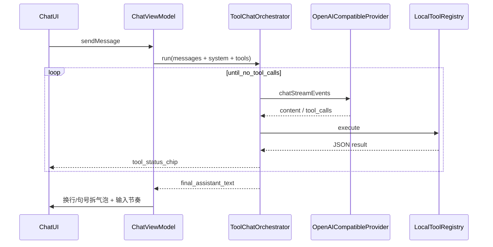

# Agent Chat

Android 原生 **AI 伴侣聊天客户端**：人设扮演、可调用本地工具、长期记忆、口语化短气泡节奏与闲置主动问候。

面向 OpenAI 兼容 API（自定义 Base URL / Key / 模型）。

---

## 技术栈

| 层级 | 技术 |
|------|------|
| 语言 | Kotlin 2.0 / JVM 17 |
| UI | Jetpack Compose + Material 3 |
| 架构组件 | Navigation Compose、ViewModel、Lifecycle |
| DI | Hilt |
| 本地存储 | Room、SharedPreferences、EncryptedSharedPreferences（API Key） |
| 网络 | Retrofit + OkHttp + Moshi（SSE 流式） |
| 后台任务 | WorkManager（主动问候） |
| 最低系统 | Android 8.0（API 26），compile/target SDK 36 |

---

## 架构概览

采用经典分层，业务以「对话编排 + 工具循环」为中心：

```
┌─────────────────────────────────────────────────────────┐
│  ui/          Compose 页面 + ViewModel                   │
│  conversation / chat / persona / settings / memory      │
└───────────────────────────┬─────────────────────────────┘
                            │
┌───────────────────────────▼─────────────────────────────┐
│  data/                                                  │
│  ├── ai/           编排、提示词注入、本地工具注册表        │
│  ├── provider/     OpenAI 兼容流式协议（含 tools）        │
│  ├── repository/   会话 / 人设 / 记忆 / Provider          │
│  ├── local/        Room Entity + DAO                    │
│  ├── memory/       异步增量摘要                          │
│  ├── proactive/    闲置主动问候 Worker                   │
│  └── settings/     伴侣感 / 工具开关                     │
└───────────────────────────┬─────────────────────────────┘
                            │
┌───────────────────────────▼─────────────────────────────┐
│  domain/        Message / Persona / Memory / AppError   │
│  di/            Hilt Module                             │
└─────────────────────────────────────────────────────────┘
```

### 对话与工具循环



核心类：

- `ToolChatOrchestrator` — 多轮 tool 调用（上限 8 步）
- `OpenAICompatibleProvider` — SSE；产出 `ContentDelta` / `ToolCallDelta` / `Finished`
- `LocalToolRegistry` — 按设置开关组装工具定义
- `PromptContextInjector` — 人设占位符、口语风格层、当前时间、记忆块、时间间隔提醒
- `ReplySegmenter` — 优先按换行拆气泡，回退按句号

---

## 功能一览

### 聊天与人设

- OpenAI 兼容流式对话，多 Provider 配置（加密存 Key）
- 人设：System Prompt、Temperature、开场白；智能导入 / JSON 导入导出
- 口语伴侣风格层（可关）：短句、少列表、即时通讯式换行
- 自然聊天节奏：完整生成后分段气泡 + 「正在输入」
- Markdown 渲染、会话导出（文本 / 图片）

### 记忆

- **工具记忆**：模型通过 `memory` 增删改查，多条事实注入 System Prompt
- **增量摘要**：对话达阈值后异步滚动摘要（失败不影响主对话）
- 人设维度隔离；记忆管理弹窗可手动删除

### 本地工具（模型可调用）

| 工具 | 说明 | 默认 |
|------|------|------|
| `memory` | 长期记忆 CRUD | 开 |
| `get_current_time` | 本地时间 / 星期 / 时段 | 开 |
| `get_battery` | 电量与充电状态 | 开 |
| `get_device_info` | 品牌型号 / Android 版本 | 开 |
| `calendar_events` | 读近期日程 / 写简单事件 | 开（需日历权限） |
| `set_alarm` | 调起系统闹钟 | 开 |
| `get_location` | 粗略定位 | 关 |
| `get_app_usage` | 今日 App 使用时长 | 关（需「使用情况访问」） |

聊天时间线展示轻量工具过程条（可展开结果摘要）。

### 主动问候

开启后，WorkManager 周期性检查：闲置超过设定小时，用当前人设生成一句短问候并通知；点击进入对应会话。

---

## 目录结构

```
app/src/main/java/com/agent/chat/
├── AgentChatApp.kt / MainActivity.kt
├── di/                         # Hilt
├── domain/model|error/
├── data/
│   ├── ai/                     # Orchestrator、Prompt、tool/
│   ├── provider/               # AIProvider + SSE 模型
│   ├── repository/
│   ├── local/                  # Room
│   ├── memory|persona|proactive|settings|security/
│   └── error/
└── ui/
    ├── navigation/
    ├── chat|conversation|persona|settings|memory/
    ├── components|theme|export/
```

---

## 构建与运行

环境：Android Studio、JDK 17+、Android SDK。

```bash
./gradlew assembleDebug     # Debug APK
./gradlew assembleRelease   # Release APK
```

用 Android Studio 打开本目录，Sync Gradle 后运行 `app` 模块。

首次使用：进入 **设置** 配置 Provider（Base URL / API Key / 模型），再创建人设开始聊天。敏感工具与主动问候在设置中按需开启。

---

## 设计取舍（简要）

- **体验优先**：人设与记忆注入上限放宽；风格层与工具结果由模型用口语消化，避免「根据工具返回」腔。
- **工具自研**：对齐常见伴侣客户端的 tools 协议能力，代码独立实现，不拷贝第三方 AGPL 源码。
- **UI 自研**：冷灰底 + 低饱和靛蓝强调，工具过程为轻量条而非插件式面板。
